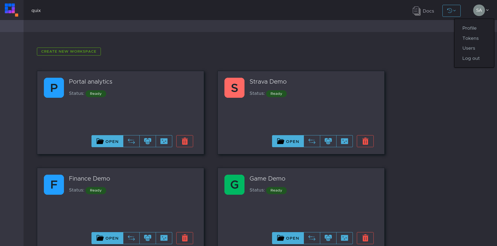
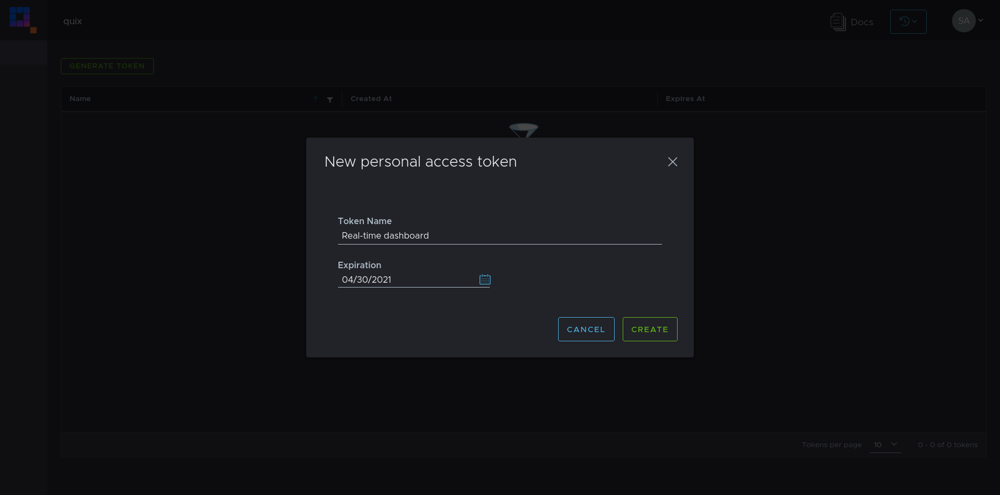
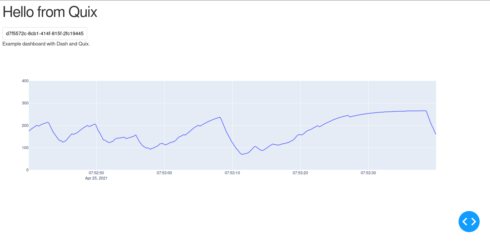
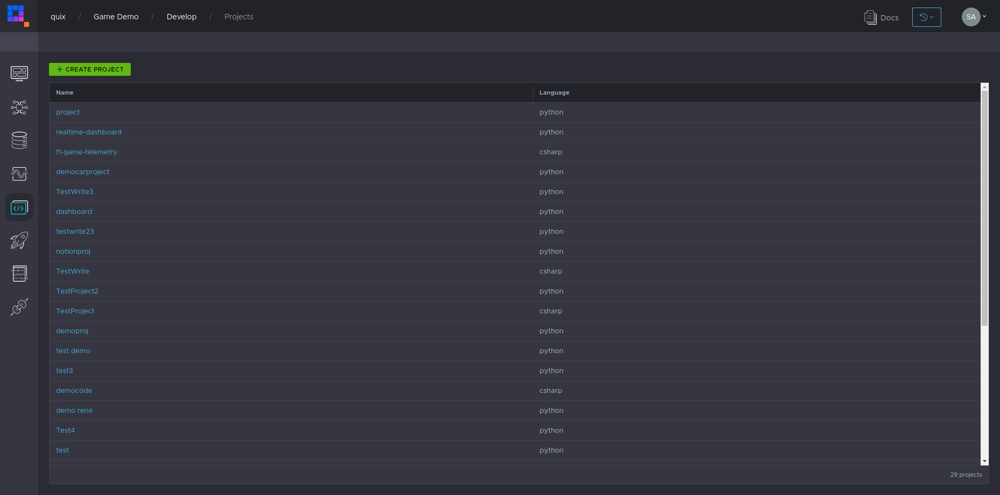
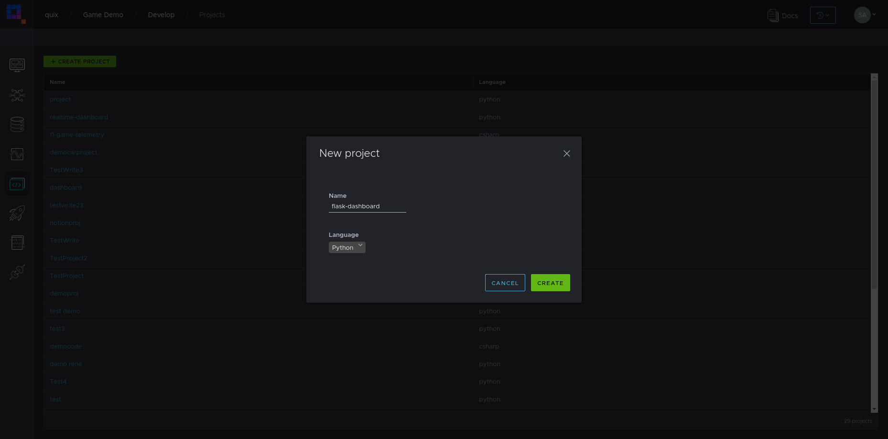
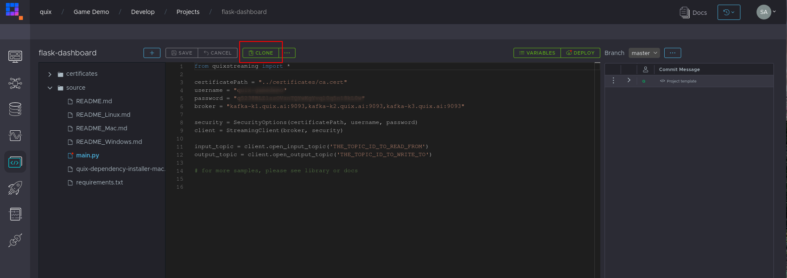
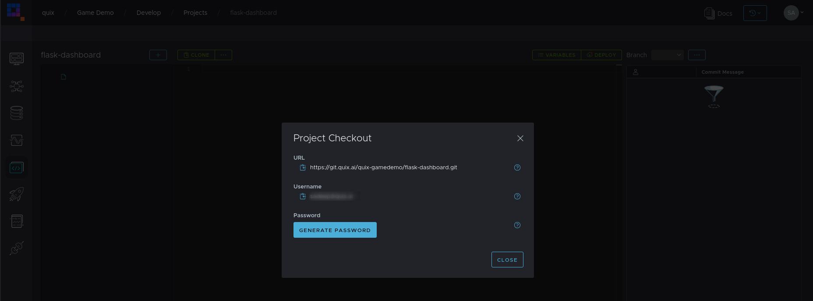
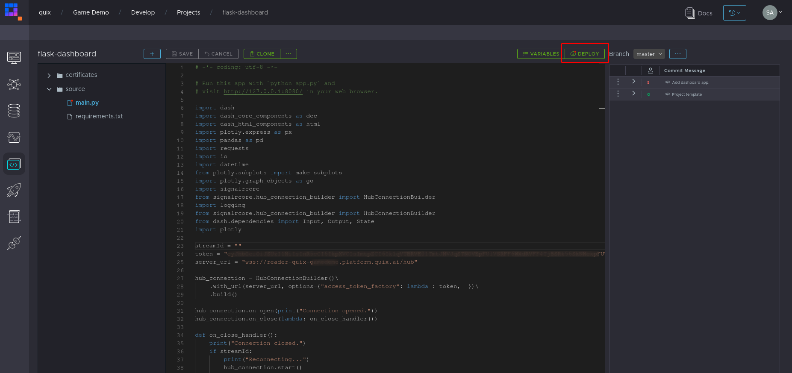
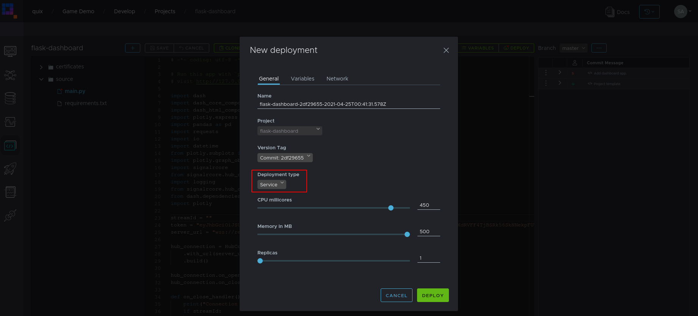
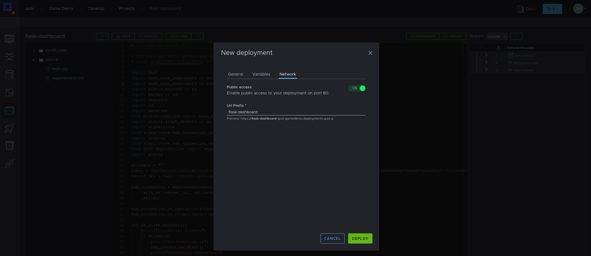

# Real-time dashboard using Flask

This example shows how to create a client-side dashboard using Python [Flask](https://flask.palletsprojects.com/en/1.1.x/) framework that streams data from Quix and makes live updates to the dashboard, and deploy the application to the public domain using Quix.

## Setup

The dashboard connects to a live stream on Quix and displays stream data on the dashboard. Therefore, you need to make sure there is a live Quix data stream for the dashboard to connect to. You can refer to our [documentation](https://documentation.platform.quix.ai/sdk/python-how-to/#connecting-to-quix) on how to create and write live data to a Quix stream. If you do not already have a Quix account, [sign up](https://portal.platform.quix.ai/self-sign-up) for a free account.

This project uses [SignalR core client](https://github.com/mandrewcito/signalrcore) to connect to Quix over websockets. You can use any compatible Python implementation of SignalR.

## Obtain credentials for Quix

Quix APIs are secured using OAuth2.0 bearer tokens. Dashboard must use a Quix a personal access token (PAT) to read data from Quix.

 1. Login to [Quix](https://portal.platform.quix.ai/workspaces).
 2. Click on the profile icon in the top right corner and click on "Tokens" to navigate to PAT tab.
    
 3. Click on the "Generate Token" button to open the dialog to create a new PAT.
    
 4. Enter a name for your PAT and an expiration date, and click on the "Create" button to generate the PAT.
    
 5. Copy the PAT displayed in the proceeding dialog and paste it into the `your_token` placeholder in the src/main.py file in this project.
    
    
## Debug the application in local environment

After obtaining a PAT for dashboard, you can test and debug the application in a local environment.

 1. Navigate to the src directory and install the required dependencies (from requirements.txt file) using `pip install -r requirements.txt`. We recommend that you use a Python virtual environment like [venv](https://docs.python.org/3/tutorial/venv.html).
 2. Make sure that there is live data in the Quix stream and run the dashboard application using `python main.py`.
 3. Copy the stream id of the live stream from Quix portal.
    
 4. Navigate to http://localhost:8080 in your web browser and enter the stream id from the previous step and you will start to see some data in the graph.
    
    
## Deploy to Quix

Now that we have a working client-side dashboard capable of live streaming data from Quix, we can deploy it and make it available over the world wide web.

 1. Navigate to the "Develop" tab in Quix and click on the "Create Project" button.
     
 2. Enter a project name, select "python" for language and click on "Create" button to create the project.
     
 3. After creating the project, you will be automatically redirected to the Quix code editor with integrated git version control and your newly created project will be open in it with some default project files. We will push our flask project to Quix using git.
 4. In the online code editor, click on "Clone" button to open the git credentials dialog.
    
 5. Click on "Generate Password" in the git credentials dialog to create a git password. Take note of the git project url, username and the newly generated password as we will need them to push our project to Quix.
    
 6. Clone the project using the credentials provided by running `git clone {your_git_url}` and enter the username and the password when prompted.
 7. Delete all the files in the "source" folder of the newly cloned project and copy the main.py and requirements.txt file from the src folder of this project and paste them into the source directory of the cloned project.
 8. Commit your changes to Quix using the usual git flow of `git add .`, `git commit -m "Add flask dashboard app."` and `git push`.
 9. Head back to the Quix portal and open the project we just pushed and click on the "Deploy" button to open the deployment dialog.
    
 10. In the deployment dialog, make sure that the deployment type is set to "service", adjust the CPU and memory (if unsure, set CPU millicores to 450 and memory to 500MB). For testing purposes, 1 replica is sufficient, but you can add high availability to your application by increasing the replica count in a production scenario.
    
 11. Select the "Network" tab in the deployment dialog and enable public access to your dashboard by throwing the switch to ON and enter a url prefix for your site like "dashboard". This allows anyone to access the dashboard on the world wide web using a url like https://{your_prefix}-{your_organisation}-{your_workspace}.deployments.quix.ai (The exact url will be displayed in the deployment dialog when you enter the url prefix).
    
 12. Click on the "Deploy" button and your deployment will begin. You will be redirected to the deployments page on which you will see your deployment in progress.
    
