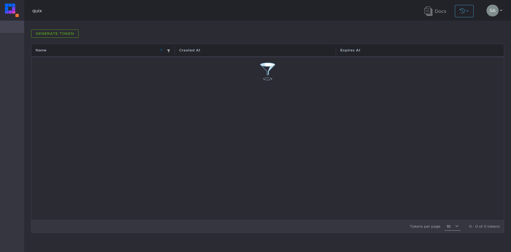
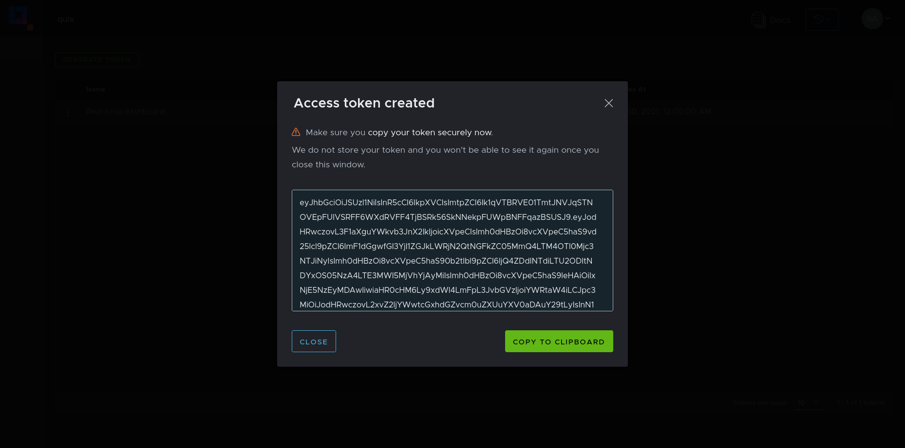
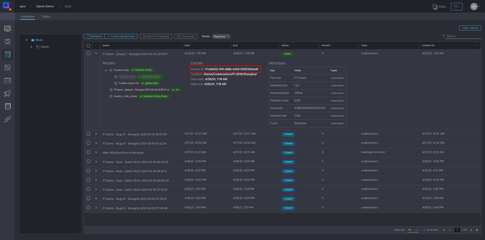

# Real-time dashboard using Flask

This example shows how to create a client-side dashboard using Python [Flask](https://flask.palletsprojects.com/en/1.1.x/) framework that streams data from Quix and makes live updates to the dashboard, and deploy the application to the public domain using Quix.

## Setup

The dashboard connects to a live stream on Quix and displays stream data on the dashboard. Therefore, you need to make sure there is a live Quix data stream for the dashboard to connect to. You can refer to our [documentation](https://documentation.platform.quix.ai/sdk/python-how-to/#connecting-to-quix) on how to create and write live data to a Quix stream. If you do not already have a Quix account, [sign up](https://portal.platform.quix.ai/self-sign-up) for a free account.

This project uses [SignalR core client](https://github.com/mandrewcito/signalrcore) to connect to Quix over websockets. You can use any compatible Python implementation of SignalR.

## Obtain credentials for Quix

Quix APIs are secured using OAuth2.0 bearer tokens. Dashboard must use a Quix a personal access token (PAT) to read data from Quix.

 1. Login to [Quix](https://portal.platform.quix.ai/workspaces).
 2. Click on the profile icon in the top right corner and click on "Tokens" to navigate to PAT tab.
    
 3. Click on the "Generate Token" button to open the dialog to create a new PAT.
    
 4. Enter a name for your PAT and an expiration date, and click on the "Create" button to generate the PAT.
    
 5. Copy the PAT displayed in the proceeding dialog and paste it into the `your_token` placeholder in the src/main.py file in this project.
    
    
## Debug the application in local environment

After obtaining a PAT for dashboard, you can test and debug the application in a local environment.

 1. Navigate to the src directory and install the required dependencies (from requirements.txt file) using `pip install -r requirements.txt`. We recommend that you use a Python virtual environment like [venv](https://docs.python.org/3/tutorial/venv.html).
 2. Make sure that there is live data in the Quix stream and run the dashboard application using `python main.py`.
 3. Copy the stream id of the live stream from Quix portal.
    
 4. Navigate to http://localhost:8080 in your web browser and enter the stream id from the previous step and you will start to see some data in the graph.
    
